## 个人网盘系统项目

### 项目介绍

本项目通过 vite+vue3 实现了网盘系统，系统支持文件上传、下载、删除、分享、分组管理等基础操作。同时系统集成了好友聊天、AI 问答助手、文件加密传输等功能，用户还可在平台内通过 WebSocket 实现实时通讯，实现 AI 问答功能。

### 使用的技术栈

vite + vue3 + ts + bootstrap + axios

### 项目运行

```
git clone https://github.com/hxysj/net-disk.git

cd net-disk

npm install

npm run dev
```

### 需要进行配置的内容

#### 大模型的 API key

项目中使用了阿里百炼的大模型 api 来实现 AI 问答功能，需要再 view/communicationSession.vue 中进行 key 的配置

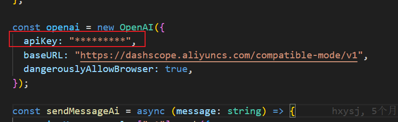

### 项目的效果图

#### 系统登陆页面


#### 系统首页

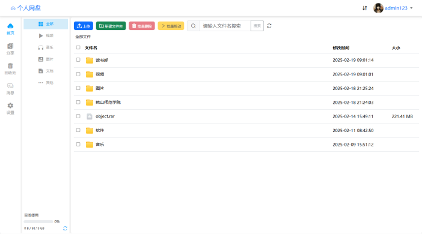

#### 文件上传界面

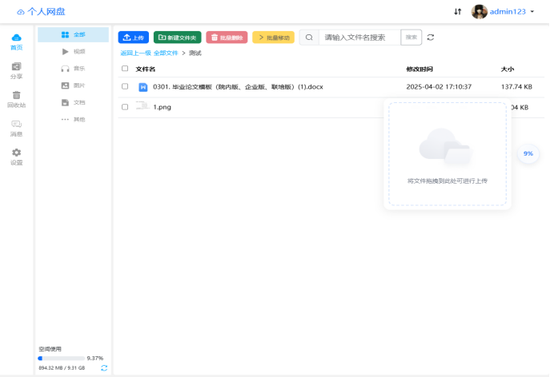

#### 文件上传进度显示图

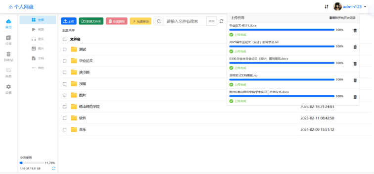

#### 图片预览效果图

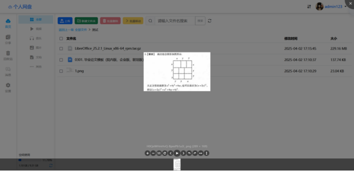

#### 视频预览效果图

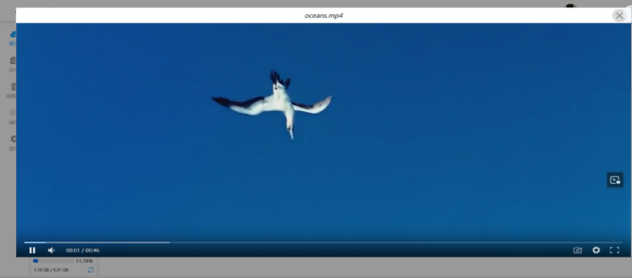

#### 不支持在线预览的文件提示界面图

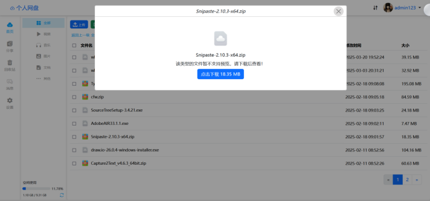

#### 分享链接校验图

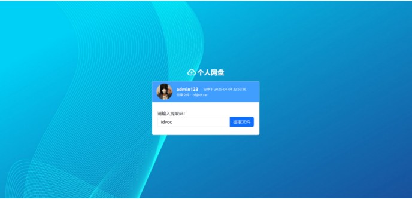

#### 分享内容显示界面图

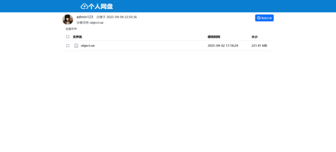

#### 添加好友模块

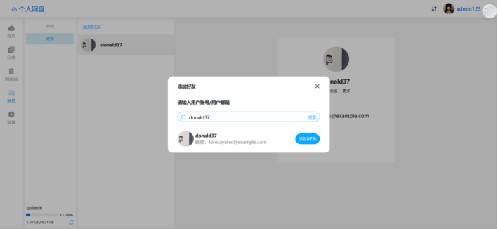

#### 好友列表管理效果图

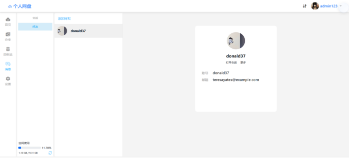

#### 聊天会话显示界面图

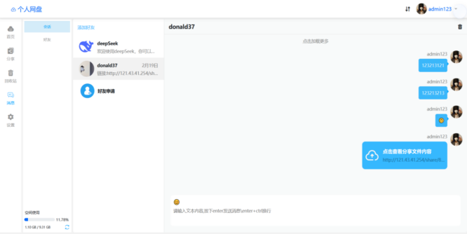

#### 系统文件管理图

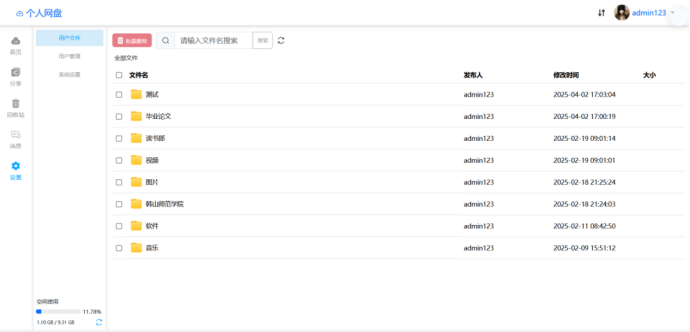

#### 系统用户管理图

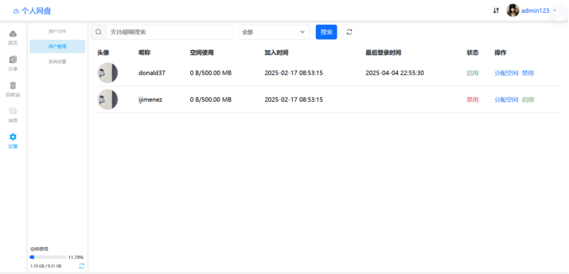

### 后端项目地址

net-disk-server: https://github.com/hxysj/net-disk-server
